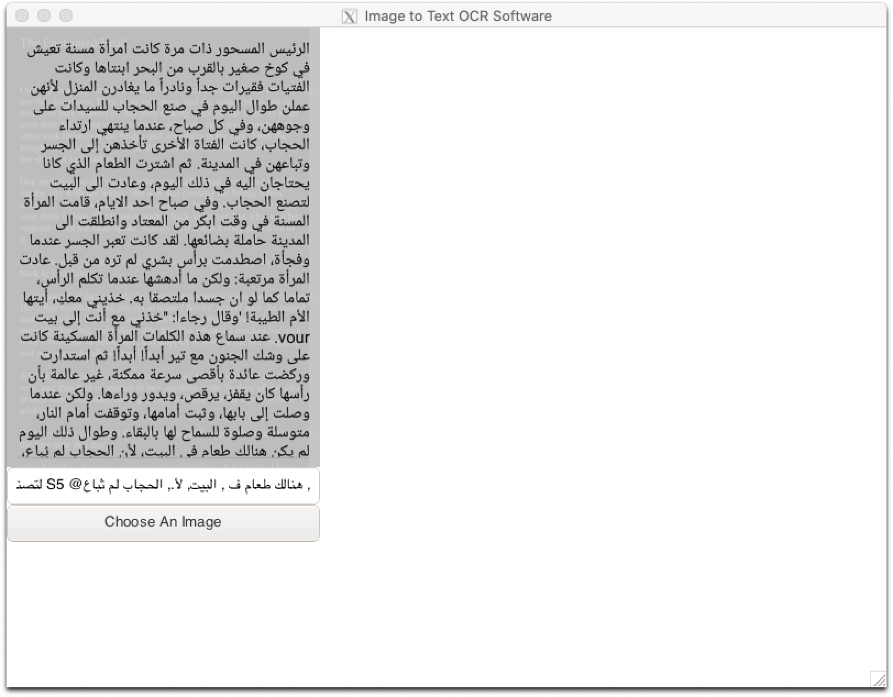

# Image to Text OCR Software

This software is built with [Go](https://golang.org) language and [Gtk3](https://github.com/gotk3/gotk3) to be performant cross platform. The OCR library used is [tesseract-OCR](https://github.com/tesseract-ocr/tesseract) with the [gosseract](https://github.com/otiai10/gosseract) wrapper.

## features, goals and values

- scalable : take advantage of all CPU cores to get the job done faster
- bulk : coroutines and parallelism for tasks / jobs
- easy to use
- available on all operating systems
- intuitive graphical user interface
- composable CLI app for scripts and automation

## Done & TO-DO

- [ ] Debian
- [ ] snap
- [ ] flatpak
- [ ] Elementary OS (if possible)
- [ ] Mac OS (via HomeBrew)
- [ ] Windows (if possible)
